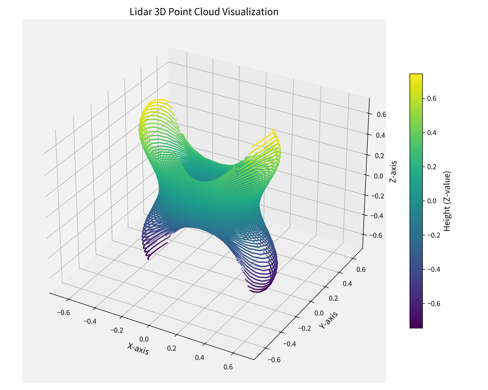
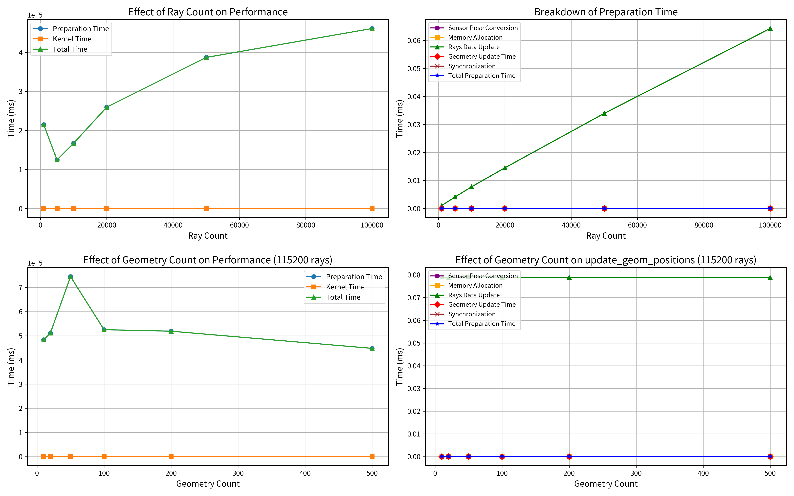
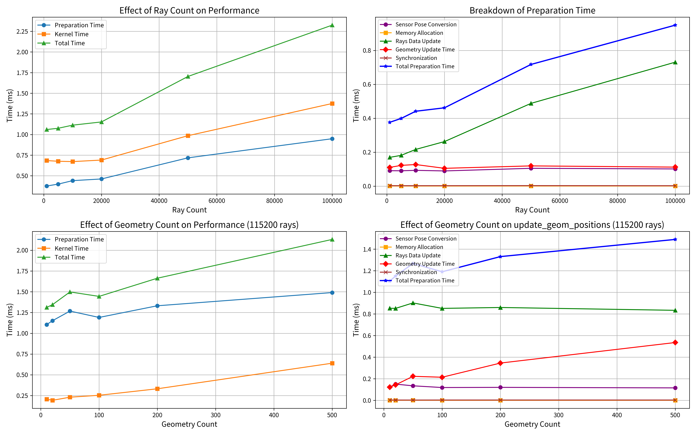

# BM result

## Install
```bash
uv pip install -r requirements.txt
```

## System
```bash
.-/+oossssoo+/-.               yiyi@yiyi-MS-A2
`:+ssssssssssssssssss+:`           ---------------
-+ssssssssssssssssssyyssss+-         OS: Ubuntu 24.04.3 LTS x86_64
.ossssssssssssssssssdMMMNysssso.       Host: MS-A2 1.0
/ssssssssssshdmmNNmmyNMMMMhssssss/      Kernel: 6.14.0-29-generic
+ssssssssshmydMMMMMMMNddddyssssssss+     Uptime: 7 hours, 27 mins
/sssssssshNMMMyhhyyyyhmNMMMNhssssssss/    Packages: 2937 (dpkg), 22 (snap)
.ssssssssdMMMNhsssssssssshNMMMdssssssss.   Shell: zsh 5.9
+sssshhhyNMMNyssssssssssssyNMMMysssssss+   Resolution: 1920x1080
ossyNMMMNyMMhsssssssssssssshmmmhssssssso   DE: GNOME 46.0
ossyNMMMNyMMhsssssssssssssshmmmhssssssso   WM: i3
+sssshhhyNMMNyssssssssssssyNMMMysssssss+   Theme: Nordic [GTK2/3]
.ssssssssdMMMNhsssssssssshNMMMdssssssss.   Icons: Arc [GTK2/3]
/sssssssshNMMMyhhyyyyhdNMMMNhssssssss/    Terminal: x-terminal-emul
+sssssssssdmydMMMMMMMMddddyssssssss+     CPU: AMD Ryzen 9 9955HX (32) @ 4.560GHz
/ssssssssssshdmNNNNmyNMMMMhssssss/      GPU: NVIDIA 07:00.0 NVIDIA Corporation Device 2c02
.ossssssssssssssssssdMMMNysssso.       GPU: AMD ATI 01:00.0 Device 13c0
-+sssssssssssssssssyyyssss+-         Memory: 16123MiB / 88151MiB
`:+ssssssssssssssssss+:`
.-/+oossssoo+/-.

+-----------------------------------------------------------------------------------------+
| NVIDIA-SMI 580.76.05              Driver Version: 580.76.05      CUDA Version: 13.0     |
+-----------------------------------------+------------------------+----------------------+
| GPU  Name                 Persistence-M | Bus-Id          Disp.A | Volatile Uncorr. ECC |
| Fan  Temp   Perf          Pwr:Usage/Cap |           Memory-Usage | GPU-Util  Compute M. |
|                                         |                        |               MIG M. |
|=========================================+========================+======================|
|   0  NVIDIA GeForce RTX 5080        Off |   00000000:07:00.0 Off |                  N/A |
|  0%   50C    P8             10W /  360W |      16MiB /  16303MiB |      0%      Default |
|                                         |                        |                  N/A |
+-----------------------------------------+------------------------+----------------------+

```




## CPU

```bash
uv run python test/cpu_benchmark.py --save-fig --profiling
```


## GPU
```bash
uv run python test/ti_benchmark.py --save-fig --profiling
```

